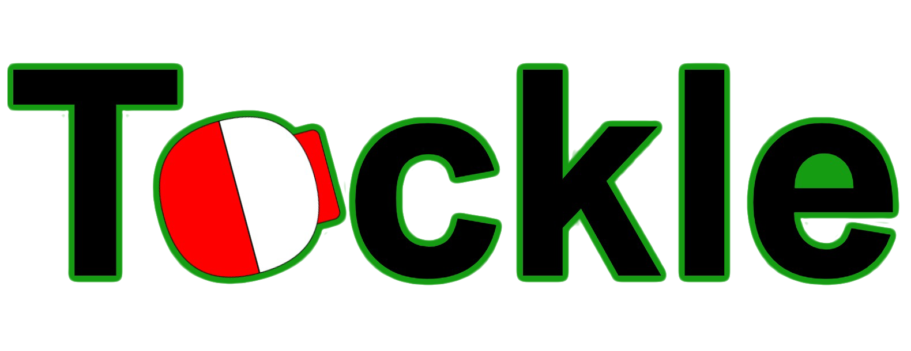
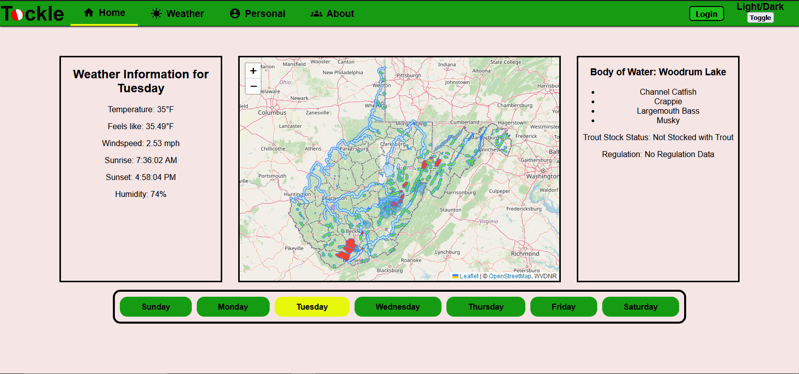
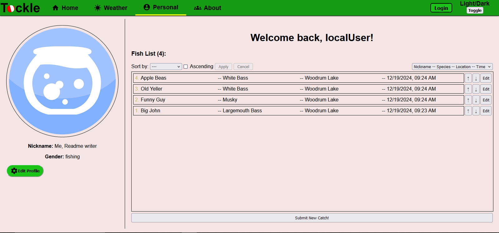

# 
A webapp of various resources useful to fishermen of WV, including a detailed map, weather data, and user profile for tracking fish caught.

As a new fisherman, it can be a hassle wrapping your head around what all information you might need: where to catch what fish, fishing regulations, etc. 
With tackle it's all available in one place, accessible anywhere.

## Features
- Map of all bodies of water in WV
  - List of species available per body of water
  - List of fishing regulations for bodies of water
- Daily week's weather selector
- User profile
  - Profile picture
  - Fishlist: list of caught fish

 
## Available Scripts

In the subdirectory tackle-app-src, you can run:

### `npm start`

Launch both the server and frontend for development purposes.\
See "npm run start-frontend" and "npm run start-backend" for more details.

### `npm run start-backend`

Launches the server for development purposes.\
Crucial when debugging for account login and weather data retrieval.

### `npm run start-frontend`

Runs the app in the development mode.\
Open [http://localhost:3000](http://localhost:3000) to view it in your browser.

The page will reload when you make changes.\
You may also see any lint errors in the console.

### `npm test`

Launches the test runner in the interactive watch mode.\
See the section about [running tests](https://facebook.github.io/create-react-app/docs/running-tests) for more information.

### `npm run build`

Builds the app for production to the `build` folder.\
It correctly bundles React in production mode and optimizes the build for the best performance.

The build is minified and the filenames include the hashes.\
Your app is ready to be deployed!

See the section about [deployment](https://facebook.github.io/create-react-app/docs/deployment) for more information.

### `npm run eject`

**Note: this is a one-way operation. Once you `eject`, you can't go back!**

If you aren't satisfied with the build tool and configuration choices, you can `eject` at any time. This command will remove the single build dependency from your project.

Instead, it will copy all the configuration files and the transitive dependencies (webpack, Babel, ESLint, etc) right into your project so you have full control over them. All of the commands except `eject` will still work, but they will point to the copied scripts so you can tweak them. At this point you're on your own.

You don't have to ever use `eject`. The curated feature set is suitable for small and middle deployments, and you shouldn't feel obligated to use this feature. However we understand that this tool wouldn't be useful if you couldn't customize it when you are ready for it.  

MIT © WVU-CS330-2024-08-Group10
